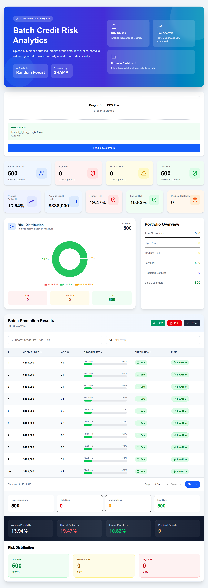
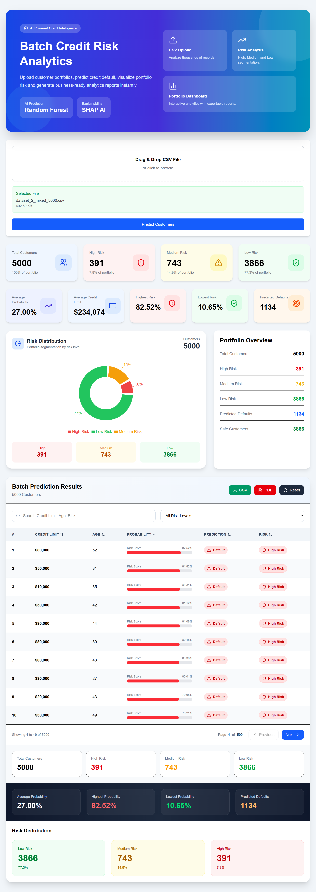

<h1 align="center">CreditWise AI</h1>

<p align="center">
<b>AI-Powered Credit Risk Intelligence Platform</b>
</p>

<p align="center">
Predict customer credit default risk using Machine Learning, explain predictions with SHAP, and analyze entire customer portfolios through an interactive analytics dashboard.
</p>

<p align="center">


</p>

---

# Overview

CreditWise AI is an end-to-end Machine Learning application designed to predict customer credit default risk using a Random Forest Classifier.

The platform combines Machine Learning, Explainable AI (SHAP), interactive analytics, and portfolio-level risk assessment to provide a complete credit risk intelligence solution.

Built with a **FastAPI backend** and **React frontend**, CreditWise AI supports both individual customer predictions and large-scale batch portfolio analysis through an intuitive web interface.

---

# Key Features

## Individual Credit Risk Prediction

- Predict customer default probability
- Low / Medium / High risk classification
- AI-powered prediction summary
- Explainable AI using SHAP

---

## Batch Portfolio Analysis

- Upload CSV portfolios
- Analyze thousands of customers
- Portfolio-level analytics
- Risk segmentation
- Search, filtering and pagination
- CSV export
- PDF report generation

---

## Interactive Dashboard

- Portfolio overview
- Risk distribution visualization
- Average default probability
- Highest & lowest risk customers
- Predicted default statistics
- Responsive analytics interface

---

## Explainable AI

- SHAP feature importance
- Feature contribution analysis
- Human-readable prediction explanation
- Model transparency

---

# Technology Stack

## Frontend

- React
- Vite
- Tailwind CSS
- Axios
- Recharts
- html2canvas
- jsPDF

---

## Backend

- FastAPI
- Python
- SQLite
- Pandas
- NumPy

---

## Machine Learning

- Scikit-learn
- Random Forest Classifier
- SHAP
- Joblib

---

# Machine Learning Pipeline

```text
Customer Information
        │
        ▼
Feature Engineering
        │
        ▼
Random Forest Classifier
        │
        ▼
Prediction Probability
        │
        ├────────────► Risk Classification
        │
        └────────────► SHAP Explainability
```

---

# System Architecture

```text
                 React + Vite
                       │
                  Axios REST API
                       │
                 FastAPI Backend
                       │
          Feature Engineering Layer
                       │
        Random Forest ML Classifier
                       │
          SHAP Explainability Engine
                       │
        Prediction & Analytics Output
```

---

# Risk Classification

| Default Probability | Risk Level |
|--------------------:|------------|
| < 40% | 🟢 Low Risk |
| 40% – 69.99% | 🟡 Medium Risk |
| ≥ 70% | 🔴 High Risk |

---

# Dataset

The model is trained using the **UCI Default of Credit Card Clients Dataset**.

### Features

- Customer demographics
- Credit limit
- Repayment history
- Bill statements
- Previous payment amounts

### Target

Predict whether a customer is likely to default on the next month's credit payment.

---

# Application Preview

## Batch Analytics Dashboard



---

## Batch Prediction Results



---

# Project Structure

```text
CreditWise-AI
│
├── app/                    # FastAPI backend
├── frontend-react/         # React frontend
├── data/                   # Dataset
├── models/                 # Trained ML model
├── notebooks/              # Model development
├── reports/                # Generated reports
├── screenshots/            # README screenshots
├── src/                    # ML pipeline
├── tests/                  # Testing
├── requirements.txt
└── README.md
```

---

# Installation

## Clone Repository

```bash
git clone https://github.com/Aswin20023/CreditWise-AI.git

cd CreditWise-AI
```

---

## Backend

Install dependencies

```bash
pip install -r requirements.txt
```

Run FastAPI

```bash
uvicorn app.main:app --reload
```

Backend

```
http://localhost:8000
```

Swagger API

```
http://localhost:8000/docs
```

---

## Frontend

```bash
cd frontend-react

npm install

npm run dev
```

Frontend

```
http://localhost:5173
```

---

# API Endpoints

| Method | Endpoint | Description |
|---------|----------|-------------|
| POST | `/predict` | Predict single customer credit risk |
| POST | `/batch/predict` | Batch CSV prediction |
| POST | `/explain` | Generate SHAP explanation |
| GET | `/dashboard` | Dashboard analytics |
| GET | `/history` | Prediction history |
| GET | `/health` | Health check |

---

# Project Highlights

- End-to-end Machine Learning solution
- Explainable AI using SHAP
- Portfolio-level credit risk analytics
- Interactive React dashboard
- FastAPI REST API
- CSV portfolio analysis
- Professional PDF reporting
- Responsive user interface
- Clean project architecture
- Production-ready code structure

---

# Future Improvements

- User authentication
- PostgreSQL database
- Docker containerization
- CI/CD pipeline
- Cloud deployment
- Model monitoring
- Automated retraining
- Multi-model comparison
- Role-based access control

---

# Author

## Aswin A Manchakkal

GitHub:
https://github.com/Aswin20023

Project Repository:
https://github.com/Aswin20023/CreditWise-AI

---

# License

This project was developed for educational, research, and portfolio purposes.
